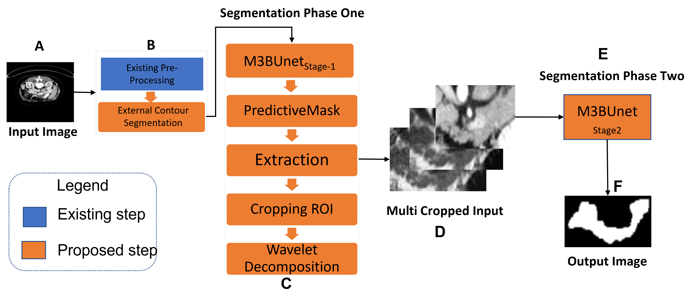
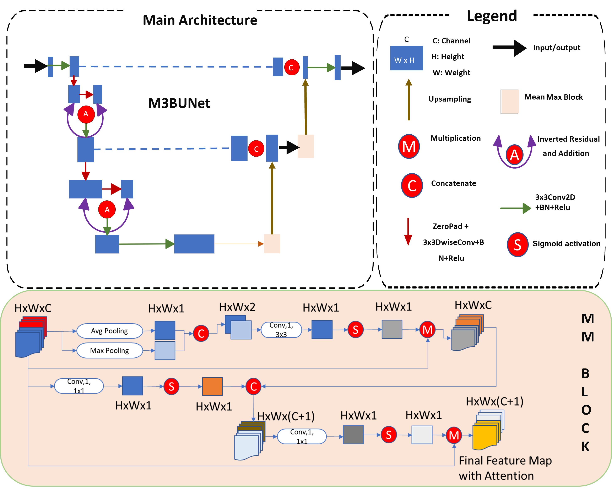

# M3BUNet
this M3BUnet was used two-stage to do pancreas segmentation with a coarse to fine manner the overall workflow is as shown in pict. 1

the model picture was shown in picture 2.

for segmentation_phase_1 and phase_2 have the same code, and same hyeperparameter setting. the difference is only in the input image,
for phase 1 the input image size is 256x256 and the input images have been undegone the external contour process.

for phase_2 the input size is 64x64 and the input images consist of cropped original image and wavelet decomposition images. 
